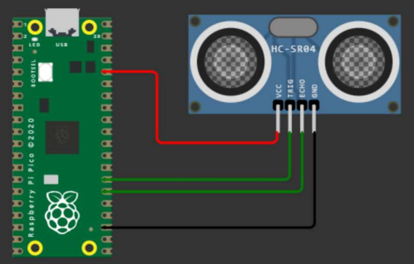

# 🍓 Sistemas programables - Raspberry pi pico 

## Resumen
En este repositorio se encuentran las practicas realizadas en la materia de sistemas programables, en el cual se utilizo un **raspberry pi pico**, Thonny (IDE) y MicroPython.

<p align="center">
    
</p>


## Practicas
- ## 📨 [Comunicación Serial](./Comunicacion%20Serial/main.py)
### Descripción
En esta practica se realizo la comunicacion serial entre la raspberry pi pico y la computadora, en la cual se envio un mensaje desde la computadora a la raspberry pi pico y esta lo regreso en mayusculas.

<details>
<summary>Diagrama - resultado</summary>
<p align="center">
   <a>
     
    <a>
     
</p>
</details>


- ## 🌤️ [DHT](./dht/dht.py)
### Descripción
En esta practica se realizo la lectura de un sensor de temperatura y humedad, en el cual presenta la información en terminal.

<details>
<summary>Diagrama - resultado</summary>
<p align="center">
   <a>
     
    <a>
     
</p>
</details>


- ## 🖥️💻⌨️⌨ [Interfaz Serial](./InterfazSerial/src/main/java/mx/tecnm/cdhidalgo/interfazserial/TerminalSerial.java)
### Descripción
En esta practica se realizo una interfaz grafica en java para la comunicacion serial entre la raspberry pi pico y la computadora, en la cual se envio un mensaje desde la computadora a la raspberry pi pico comunicandose por medio de la interfaz grafica y encendiendo el led integrado en la raspberry pi pico.)  

<details>
<summary>Diagrama - resultado</summary>
<p align="center">
   <a>
     
    <a>
     
</p>
</details>


- ## 🪴💧 [Mini Proyecto](./MiniProyectoRegadoAutomatico/regado.py)
### Descripción
En esta practica se realizo un sistema de regado automatico, en el cual se utilizo un sensor de humedad para detectar cuando la tierra se encuentra seca y asi encender una bomba de agua (por medio de un rele) para regar la planta.

<details>
<summary>Diagrama - resultado</summary>
<p align="center">
   <a>
     
    <a>
     
</p>
</details>


- ## 🖥️ [Oled](./Oled/main.py) 
### Descripción
En esta practica se realizo la comunicacion entre la raspberry pi pico y una pantalla oled, en la cual se envio un mensaje desde la computadora a la raspberry pi pico y esta lo mostro en la pantalla oled.

<details>
<summary>Diagrama - resultado</summary>
<p align="center">
   <a>
     
    <a>
     
</p>
</details>


- ## 1️⃣ 0️⃣ [Rele](./Rele/rele.py)
### Descripción
En esta practica se realizo la comunicacion entre la raspberry pi pico y un rele.

<details>
<summary>Diagrama - resultado</summary>
<p align="center">
   <a>
     
    <a>
     
</p>
</details>


- ## 🔴🟢🔵 [RGB](./rgb/rgb.py)
### Descripción
Practica para controlar un LED RGB (rojo, verde, azul) mediante modulación de ancho de pulso (PWM) en un microcontrolador. El módulo de la máquina se importa para usar sus clases Pin y PWM, y el módulo de tiempo se importa para usar su función de suspensión.

La función enciende está definida para tomar tres argumentos: r, g y b. Estos argumentos representan el ciclo de trabajo de los canales rojo, verde y azul del LED, respectivamente. El ciclo de trabajo es una medida de la proporción del período total en el que una señal está activa. El método duty_u16 se utiliza para establecer el ciclo de trabajo para cada canal de color. El ciclo de trabajo se especifica como un entero sin signo de 16 bits, donde 65535 representa el ciclo de trabajo del 100 %.

<details>
<summary>Diagrama - resultado</summary>
<p align="center">
   <a>
     
    <a>
     
</p>
</details>

- ## ⚙️🔧 [Servo](./Servo/servo.py)
### Descripción
En esta practica se realizo la comunicacion entre la raspberry pi pico y un servo motor, en la cual se envio un mensaje desde la computadora a la raspberry pi pico y esta movio el servo motor.
 
<details>
<summary>Diagrama - resultado</summary>
<p align="center">
   <a>
     
    <a>
     
</p>
</details>


- ## 👣👣 [Steper](./Steper/steper.py)
### Descripción
En esta practica se realizo la comunicacion entre la raspberry pi pico y un motor a pasos, en la cual se envio un mensaje desde la computadora a la raspberry pi pico y esta movio el motor a pasos.

Ap, Am, Bp y Bm, presumiblemente correspondientes a los cuatro cables de un motor paso a paso bipolar.

La lista de pinos contiene los cuatro objetos Pin y la lista de pasos contiene cuatro listas, cada una con cuatro elementos. Cada elemento de la lista de pasos representa un paso en la secuencia de alimentación de las bobinas del motor paso a paso.

<details>
<summary>Diagrama - resultado</summary>

   ```json
    {
    "version": 1,
    "author": "Jose Correa Morales",
    "editor": "wokwi",
    "parts": [
      {
        "type": "wokwi-pi-pico",
        "id": "pico",
        "top": -24.59,
        "left": -168.7,
        "attrs": { "env": "micropython-20230426-v1.20.0" }
      },
      {
        "type": "wokwi-stepper-motor",
        "id": "stepper1",
        "top": -77.89,
        "left": -8.87,
        "attrs": { "size": "17" }
      }
    ],
    "connections": [
      [ "pico:GP19", "stepper1:A+", "green", [ "h146.35", "v-34.89" ] ],
      [ "stepper1:B+", "pico:GP18", "yellow", [ "v42.57", "h2.85" ] ],
      [ "stepper1:B-", "pico:GP16", "cyan", [ "v70.02", "h4.68" ] ],
      [ "stepper1:A-", "pico:GP17", "magenta", [ "v59.35", "h5.27" ] ]
    ],
    "dependencies": {}
  }
   ```

</details>

- ## 🌡️🌡️ [Temperatura](./Temperatura/temperatura.py)
### Descripción
En esta practica se realizo la comunicacion entre la raspberry pi pico y un sensor de temperatura, en la cual se envio un mensaje desde la computadora a la raspberry pi pico y esta regreso la temperatura.

<details>
<summary>Diagrama - resultado</summary>

   ```json
    {
    "version": 1,
    "author": "Jose Correa Morales",
    "editor": "wokwi",
    "parts": [
      {
        "type": "wokwi-pi-pico",
        "id": "pico",
        "top": -30.68,
        "left": -62.39,
        "attrs": { "env": "micropython-20230426-v1.20.0" }
      },
      {
        "type": "wokwi-ntc-temperature-sensor",
        "id": "ntc1",
        "top": -1.79,
        "left": 40.42,
        "rotate": 90,
        "attrs": {}
      }
    ],
    "connections": [
      [ "pico:3V3", "ntc1:VCC", "red", [ "h36.65", "v107.01", "h2.35" ] ],
      [ "ntc1:GND", "pico:GND.7", "black", [ "v55.6", "h-88.07", "v-112.26" ] ],
      [ "ntc1:OUT", "pico:GP27", "green", [ "v37.97", "h-75.24", "v-84.64" ] ]
    ],
    "dependencies": {}
  }
   ```
</p>
</details>


- ## 🖥️🖼️ [TFT Screen](./TFT%20screen/main.py)
### Descripción
En esta practica se realizo la comunicacion entre la raspberry pi pico y una pantalla tft, la cual muestra una imagen (que debe estar en formato .BMP).

<details>
<summary>Diagrama - resultado</summary>
<p align="center">
   <a>
     
    <a>
     
</p>
</details>


- ## 🔈🔉🔊 [Ultrasonico](./Ultrasonico/ultrasonico.py)
### Descripción
En esta practica se realizo la comunicacion entre la raspberry pi pico y un sensor ultrasonico, en la cual se envio un mensaje desde la computadora a la raspberry pi pico y esta regreso la distancia.

<details>
<summary>Diagrama - resultado</summary>
<p align="center">
   <a>
     
    <a>
     
</p>
</details>
    
